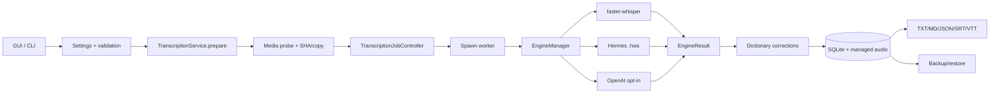
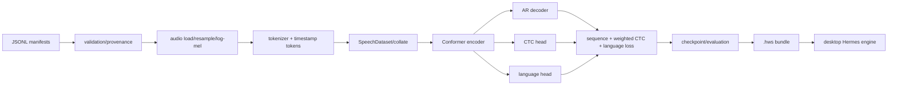

# 107 Voice Studio — технічний опис розробки

## Baseline і склад репозиторію

Документ прив’язаний до `main@fffa50b6bc26fa2e7fa2150f2260ae873a5cf511`.

| Шлях | Відповідальність |
|---|---|
| `src/hermes_voice_studio/` | desktop GUI/CLI, engines, jobs, storage, export, backup, diagnostics, model catalog |
| `src/hermes_whisper/` | experimental model/data/training/evaluation/bundle pipeline |
| `tests/` | unit/contract/evidence-harness tests для обох треків |
| `configs/` | Hermes nano/150m training configs |
| `packaging/` | PyInstaller spec і release assets |
| `scripts/` | Test-RC/build/model-release/public-tree helpers |
| `.github/workflows/` | CI, CodeQL, Dependabot і manual release validation |
| root docs + `docs/` | architecture, status, gates, security, model/data governance |

Desktop-модуль має 29 Python-файлів і близько 4.7 kLOC; Hermes — 17 файлів і близько 3.4 kLOC; `app.py` має близько 1,219 рядків і є найбільшим concentration point.

## Technology stack

- Python `>=3.11,<3.13`, setuptools/pyproject;
- Tkinter desktop UI та argparse CLI;
- SQLite WAL і JSON payload;
- `multiprocessing` зі spawn model worker;
- PyAV/FFmpeg, NumPy, sounddevice;
- faster-whisper/CTranslate2;
- PyTorch для Hermes;
- optional OpenAI SDK/keyring/pynput;
- PyInstaller packaging;
- pytest, Ruff, pip-audit, CodeQL у repo-defined workflows.

Залежності задані діапазонами; lock/constraints із hashes і SBOM відсутні. Тому фактичний resolved graph залежить від часу/платформи.

## Entry points

- GUI: package/application launcher, що створює `HermesVoiceApp`;
- CLI: `src/hermes_voice_studio/cli.py`;
- Hermes CLI: `src/hermes_whisper/cli.py`;
- build/release helpers: `scripts/build_test_rc.sh`, `scripts/build_windows.ps1`, model-release scripts;
- CI: `.github/workflows/ci.yml`, `codeql.yml`, `release.yml`.

## Desktop architecture



### Ownership and contracts

- `Settings` centralizes serializable runtime settings, але runtime type normalization is incomplete.
- `SpeechEngine`/`EngineResult` isolate UI from engine internals.
- `TranscriptionService` owns prepare/finalize and immutable `raw_text` boundary.
- `TranscriptionJobController` owns persistent worker lifecycle, timeout/cancel/restart.
- `LocalStore` owns SQLite schema, managed source copies, history and retention.
- model catalog/release modules own import/download/inventory and archive validation.
- backup module owns deterministic archive, staging, verification and reversible promotion.
- cloud modules own credentials, explicit consent paths and schema-constrained cleanup.

### Data/state transitions

`prepared -> running -> completed|failed|cancelled|timed_out` is coordinated between parent and worker. `raw_text` is written from engine output and cannot be changed by later edit/cleanup; user edits produce `corrected_text`. Managed audio may be removed after transcript retention policy, while the original source stays outside ownership.

SQLite uses `PRAGMA user_version`, short-lived connections and WAL. Cross-filesystem/SQLite retention operations and model-catalog directory changes are not fully transactional.

### Concurrency and failure handling

Model inference runs in a spawned process; timeout/cancel terminates and recreates it. Media validation/hash/copy occur before the first cancel/timeout check. Several model-management, bundle-verification and network operations still run synchronously on the Tk thread. Backup/restore uses daemon threads; app shutdown is not coordinated with an in-flight restore.

## Hermes architecture



Training supports warmup/cosine schedule, AMP, DDP and resume. Evaluation computes WER/CER/language accuracy/RTF. Current enforcement does not guarantee split disjointness, immutable audio-content fingerprint, strict consent/license semantics or exact resume. `.hws` has exact members and hashes, but no publisher signature.

## Security architecture

Primary boundary is the local OS user. Local is default; OpenAI is per-action opt-in and can be disabled with `offline_only`. Secret material is loaded from environment/keychain and excluded from settings/backups/worker payloads. Originals are never deleted. SQL values are parameterized. Model-release archive handling rejects path traversal, symlinks, duplicates, size/hash mismatch.

Important gaps: parent-process native media parsing, mutable/unsigned model trust, incomplete archive resource ceilings, plaintext sensitive storage, automatic clipboard exposure, incomplete diagnostics redaction, mutable dependency graph and non-attested unsigned releases. Threat model: [audit/107_Voice_Studio-threat-model.md](audit/107_Voice_Studio-threat-model.md).

## Configuration

User configuration is JSON plus environment variables (`HVS_*`) and platform data/config paths. OpenAI keys live in environment/keychain, not normal JSON. Settings validation checks many ranges but accepts wrong JSON value types far enough to raise unintended `TypeError`/`AttributeError`. Custom paths may leave the user profile and should be treated as an additional trust boundary.

## Build, execution and verification

Canonical repo instructions are in root `AGENTS.md`. Expected checks:

```powershell
python -m compileall -q src tests
$env:PYTHONPATH = 'src'; python -m pytest -q
python -m ruff check .
python -m build
python -m pip_audit
```

У цьому audit environment лише `compileall` був доступний локально. Інші commands були blocked через відсутні модулі, без встановлення/оновлення dependencies. GitHub CI/CodeQL на exact baseline commit були окремо перевірені як історичне remote evidence, але не замінюють current local/native/manual acceptance.

CI currently exercises desktop extras, not a deterministic `[hermes]` environment; optional Torch tests may be skipped. There is no coverage threshold or type checker.

## Packaging and release

Current artifacts are Test RC. Build scripts produce checksums/manifest, but source commit, dirty-tree state, locked dependencies, SBOM, builder identity and signed attestation are not cryptographically bound. macOS and Windows flows are not symmetric; a legacy script still references 0.2.0. Release workflow validates rather than publishes a signed production release.

## Observability and supportability

Available: CLI doctor/health, version information, redacted diagnostics intent, backup/recovery, integrity checks. Missing: structured local security/operations events, crash-report consent flow, support correlation IDs, resource metrics, release/update/rollback service, incident and vulnerability-response runbooks. Diagnostics redaction is not safe for arbitrary external/UNC paths.

## Engineering principles to preserve

- local/private by default; no automatic cloud fallback or telemetry;
- original user file is outside deletion ownership;
- `raw_text` immutable, edits only in `corrected_text`;
- engine/UI boundary via `SpeechEngine` and `EngineResult`;
- integrity hash is not publisher identity;
- desktop/faster-whisper release and Hermes research remain separate;
- no Hermes accuracy claim without licensed weights, immutable closed set and measured metrics;
- no product implementation begins from this audit without `AUDIT -> DESIGN -> USER APPROVAL`.

## Known technical debt

The traceable source of truth is [audit/FINDINGS_REGISTER.md](audit/FINDINGS_REGISTER.md). Highest-impact areas are: Hermes overlap integration, untrusted settings types, long-recording/temp-file lifecycle, uncancellable prepare stage, main-thread blocking, dataset leakage/fingerprint/provenance, CTC/resampling/metrics semantics, archive/resource/signature controls, reproducible release evidence and commercial capability gaps. The current OpenAI default is officially supported; a prior contrary hypothesis was retracted after authoritative verification.
