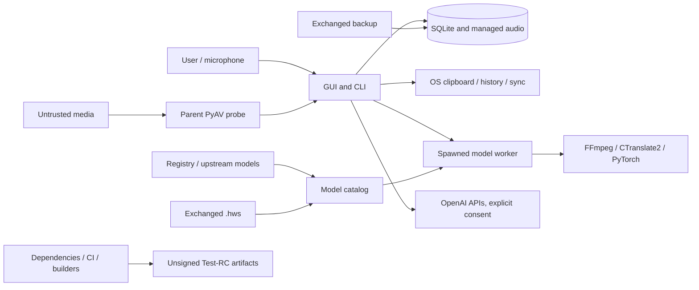

# 107 Voice Studio — threat model

## Executive summary

107 Voice Studio is a local, single-user Test-RC desktop application. It has no network listener or multi-tenant service. The main security boundary is the OS account, while user-selected media, exchanged backups/model packs, registries, dependencies and optional OpenAI calls cross trust boundaries.

No confirmed P0 was found. Top risks are native parsing of untrusted media in the parent process, mutable/unsigned model trust, archive resource exhaustion, sensitive plaintext storage/backups, and a release/dependency graph not cryptographically bound to source and builder. These are P1 commercial blockers, although some require a user to open/install an untrusted artifact or an attacker to have local/profile access.

## Scope and assumptions

In scope:

- `src/hermes_voice_studio`, `src/hermes_whisper`;
- settings, keychain/env, SQLite, managed audio, backups, diagnostics;
- media probe/FFmpeg, model catalog/registry/`.hws`;
- OpenAI STT and cleanup boundaries;
- build, packaging, CI and release evidence.

Out of scope/unverified:

- vulnerabilities inside a specific resolved native/Python dependency graph;
- live OpenAI, Hugging Face or registry behavior;
- hostile OS administrator/kernel protection;
- future SaaS/control plane not present in the repository;
- legal compliance conclusions.

Assumptions:

1. Current 0.3.0rc1 is local single-user Test-RC, not a server.
2. Media, `.hvs-backup`, `.hws` and model packs may be obtained from third parties and are untrusted inputs.
3. Audio/transcripts may be confidential or personal data.
4. OS account/filesystem is the current authentication boundary; application-level at-rest protection is absent.
5. OpenAI is explicit opt-in per action and `offline_only` is intended as a hard block.
6. No signed production-authoritative tag/release exists.
7. A model/data/archive hash proves integrity only relative to a supplied digest, not publisher identity.

## System model

### Primary components

- Tkinter GUI and CLI;
- Settings/config/keychain boundary;
- media validation and FFmpeg/PyAV native stack;
- spawned transcription worker and engine manager;
- faster-whisper/CTranslate2, Hermes/PyTorch and optional OpenAI engines;
- SQLite/local managed files, export and retention;
- backup/restore and diagnostics;
- model registry/catalog/release/archive;
- Hermes dataset/training/evaluation/bundle pipeline;
- GitHub CI/CodeQL and Test-RC packaging.

### Data flows and trust boundaries

- `TB-01`: user-selected media → parent native parser.
- `TB-02`: parent → spawned worker/native model runtime. This is lifecycle isolation, not a hardened sandbox.
- `TB-03`: remote registry/upstream/exchanged model → catalog/load.
- `TB-04`: exchanged archive → backup/model verification and filesystem/memory.
- `TB-05`: GUI/CLI → OpenAI network and provider data policy.
- `TB-06`: OS account/device → plaintext local data/backup.
- `TB-07`: package repositories/GitHub Actions/builder → distributed artifact.
- `TB-08`: corpus/provenance declarations → trained weights and commercial IP.
- `TB-09`: transcript/editor → OS clipboard, clipboard managers, sync and other applications.

## Assets

| Asset | Why it matters | Desired property |
|---|---|---|
| Original and managed audio | potentially confidential/personal; irreplaceable | confidentiality, integrity, no accidental deletion |
| Raw/corrected transcripts | customer work product | confidentiality, integrity, raw immutability, export/delete control |
| Backups | portable copy of settings/text/audio | confidentiality, authenticity, integrity, bounded restore |
| OpenAI API key | billable secret | confidentiality, scoped storage/revocation |
| Settings/dictionary | controls paths, engine, model and output | integrity, safe migration/recovery |
| Models/`.hws`/catalog | executable/native inference input and proprietary asset | publisher authenticity, integrity, compatibility, resource bounds |
| Dataset/provenance | privacy/IP basis and model-quality evidence | consent/license correctness, immutable identity, revocation |
| Release artifacts/manifests | customer trust and support identity | source/dependency/build binding, signature, rollback |
| Diagnostics/benchmark reports | may contain paths/content/references | minimization, consent, redaction |
| Clipboard text and unsaved edits | customer work product outside durable store | explicit transfer, confidentiality, no silent loss |
| Brand/entitlement | future commercial value | anti-tamper, availability, customer recovery |

## Attacker model

Considered:

- remote supplier/upstream compromise affecting registry, model, dependency or CI action;
- malicious party sharing crafted media, backup or `.hws` with a user;
- untrusted transcript content attempting prompt manipulation of cleanup;
- local same-user malware or another account with access to shared/custom directories;
- careless operator using stale/fabricated release evidence or leaking keys via CLI history;
- malicious/incorrect dataset contributor declarations.

Not assumed preventable by this app: hostile machine administrator, compromised kernel, memory scraping by same-user malware. The app must still minimize stored secrets/data and avoid widening those risks.

## Entry points

| Entry point | Input control | Existing controls | Main gap |
|---|---|---|---|
| Media import/microphone | user/third party | extension, first-frame decode, managed copy | native parent parsing, no complete byte/duration/process-tree budget |
| `.hws` import | user/third party | exact members, hashes, `weights_only=True` | unsigned publisher, unbounded `model.pt`/resource semantics |
| Model registry/upstream | network/operator | HTTPS for asset, SHA/size/archive checks | registry/final redirect/revision/signature trust incomplete |
| Backup restore | user/third party | exact members/hashes, staging/recovery | plaintext, unsigned, resource ceilings and machine-setting replay |
| Settings JSON/env | local user/software | validation/defaults | wrong types, paths/UNC, corruption semantics |
| OpenAI STT/cleanup | explicit user action | per-action consent, supported current default, 25 MB STT cap, offline mode, keychain/env | provider/env endpoint verification, prompt/data policy/cost |
| Diagnostics/export | user/support | intended redaction, explicit export | path/error leakage outside home; sensitive benchmark content |
| Automatic clipboard | successful transcript | configurable setting | enabled by default; OS history/sync/other apps outside app control |
| CLI secret input | user/shell | keychain and hidden prompt option | `--value` exposes argv/history |
| CI/build/release | maintainers/dependencies | minimal permissions, tests, audit, hashes | movable graph/actions, no lock/SBOM/attestation/signature |
| Hermes manifests/corpus | dataset operator/contributors | non-empty provenance fields | weak types/rights, leakage, content identity, revocation |

## Top abuse paths

1. Attacker shares crafted media → user imports → PyAV parses in GUI/CLI parent before worker → crash/hang or a dependency vulnerability affects the main process.
2. Upstream/registry/account or exchanged `.hws` is tampered → user explicitly installs → supplied hashes are consistent but unsigned → same-user native/PyTorch runtime consumes attacker-controlled model → crash/resource exhaustion/integrity compromise; native-code exploitability remains a hypothesis.
3. Crafted `.hws`/backup declares huge/expensive content → validation/extraction/read allocates RAM/disk/CPU without complete ceilings → application/device denial of service or interrupted restore.
4. Shared/stolen profile, device or portable backup → plaintext audio/transcripts exposed → customer confidentiality/privacy incident.
5. Mutable dependency/action resolution or stale acceptance JSON → artifact is built from a different graph/commit than assumed → consumer cannot verify or safely roll back a compromised release.
6. Invalid/false corpus consent/license and cross-split data pass weak validation → weights contain unauthorized/private data or quality evidence is inflated → commercial/legal and customer harm.
7. API key provided on command line → process list/history captures it → unauthorized billable OpenAI use.
8. Custom/UNC path or exception enters diagnostics/backup settings → shared support report or restore leaks/redirects machine-specific data.
9. Successful transcript is auto-copied → clipboard history/sync or another process reads it → confidential text leaves the application boundary without a per-transcript decision.

## Threat table

| ID | Threat / affected asset | Boundary | Preconditions | Existing controls | Likelihood | Impact | Priority | Confidence | Recommended mitigation |
|---|---|---|---|---|---:|---:|---:|---:|---|
| TM-001 | crafted media crashes/compromises parent | TB-01 | user opens malicious/corrupt media | extension/first-frame, no shell | Medium | High | P1 | Medium exploit / high DoS | disposable restricted probe, byte/duration/decode caps, pinned native stack, fuzz cases |
| TM-002 | mutable/unsigned model compromises integrity/runtime | TB-03 | install from bad registry/upstream/peer | SHA, size, path/symlink checks, `weights_only` | Medium | High | P1 | High architecture | mandatory revision, HTTPS/redirect/owner policy, signed registry/packs, load-time verification |
| TM-003 | `.hws`/backup resource exhaustion | TB-04 | open crafted archive | exact members/hash/staging | Medium | High | P1 | High | total/member/count/ratio/tensor/record/free-space limits, streaming restore |
| TM-004 | local/portable data disclosure | TB-06 | shared profile/device loss/backup access | OS account/profile boundary | Medium | High | P1 commercial | High | private ACL/modes, secure custom-dir warning, authenticated encryption and key recovery |
| TM-005 | unverifiable/malicious release graph | TB-07 | upstream/action/operator compromise or drift | CI/CodeQL/audit/checksums | Medium | High | P1 | High | locks/hashes, pinned actions, SBOM, commit/build attestation, signing/approval |
| TM-006 | crafted backup replays paths/settings | TB-04/TB-06 | restore exchanged backup | validation, cloud still consented | Low-Medium | Medium | P2 | High | separate data/settings restore, reset machine paths, diff/confirm, label UNC |
| TM-007 | API key leaks via argv/history | local shell | user supplies `--value` | keychain and hidden input alternative | Medium | Medium-High | P2 | High | remove/deprecate argv secret; hidden TTY/stdin FD only |
| TM-008 | prompt content corrupts corrected transcript | TB-05 | cleanup on malicious text and user approval | schema, proposal, undo, raw immutable | Medium | Medium | P3 | Medium | semantic diff limits/full review, provenance and cost/input caps |
| TM-009 | continuous record consumes memory/temp data persists | local lifecycle | long recording/close during work | explicit stop, eventual cleanup path | Medium | Medium-High | P1 | High | private streamed temp file, hard limits, ownership/close/crash cleanup |
| TM-010 | false provenance/leakage contaminates weights | TB-08 | Hermes training/release | documentation, non-empty fields | Medium pre-training | High | P1 pre-release | High | strict typed rights registry, content hashes, split/group leakage, revocation/model card |
| TM-011 | diagnostics/support artifact leaks paths/data | export/support | user exports report | home-prefix replacement, no keys | Medium | Medium | P2 | High | allowlisted schema, sanitize errors, basename/hash paths, adversarial tests |
| TM-012 | cancellation leaves FFmpeg child consuming resources | TB-02 | Hermes conversion + cancel/timeout | worker termination, `-nostdin` | Low-Medium | Medium | P2 | Medium | direct timeout, process group/Windows Job Object, descendant verification |
| TM-013 | auto-copy exposes transcript via clipboard/history/sync | TB-09 | successful transcript and default setting | user-configurable `auto_copy` | Medium | High for sensitive users | P1 commercial / P2 personal | High boundary / environment-dependent | default-off or explicit action, warning, managed-device policy and tests |

## Criticality calibration

No threat is rated P0 because there is no remotely reachable unauthenticated service and no confirmed exploit leading to immediate arbitrary code execution/data loss. P1 reflects a commercial blocker or plausible high-impact failure under ordinary local workflows. Risks requiring exchanged artifacts/local access may be P2 for a tightly controlled personal Test-RC but rise to P1 when distributed to paying customers.

## Focus paths

- `src/hermes_voice_studio/media.py`, `service.py`, `jobs.py`, `recorder.py`;
- `src/hermes_voice_studio/model_release.py`, `model_catalog.py`;
- `src/hermes_whisper/bundle.py`, `manifest.py`;
- `src/hermes_voice_studio/backup.py`, `storage.py`, `diagnostics.py`;
- `src/hermes_voice_studio/cloud_secrets.py`, `engines/openai_cloud.py`, `cloud_cleanup.py`;
- `scripts/build_test_rc.sh`, `create_release_manifest.py`, `build_windows.ps1`;
- `packaging/hermes_voice_studio.spec`, `pyproject.toml`, `.github/workflows/`.

## Notes on use

This model guides design and verification; it is not proof of exploitability or legal compliance. Re-run it when adding entitlement, update service, telemetry, shared storage, network API, SaaS or a publisher-signed model channel. A future server mode requires a new model for authentication, authorization, tenant isolation, abuse/rate limits, KMS, queues and support access.

## Quality check

- GUI, CLI, media, cloud, storage, backup, diagnostics, models, Hermes data/training and release paths are represented.
- Every trust boundary maps to at least one threat.
- Existing controls and gaps are separated.
- Hypothetical native exploitation is labeled; observed resource/data/provenance gaps are not overstated.
- No runtime exploit, PASS marker, release signature or legal clearance was fabricated.
