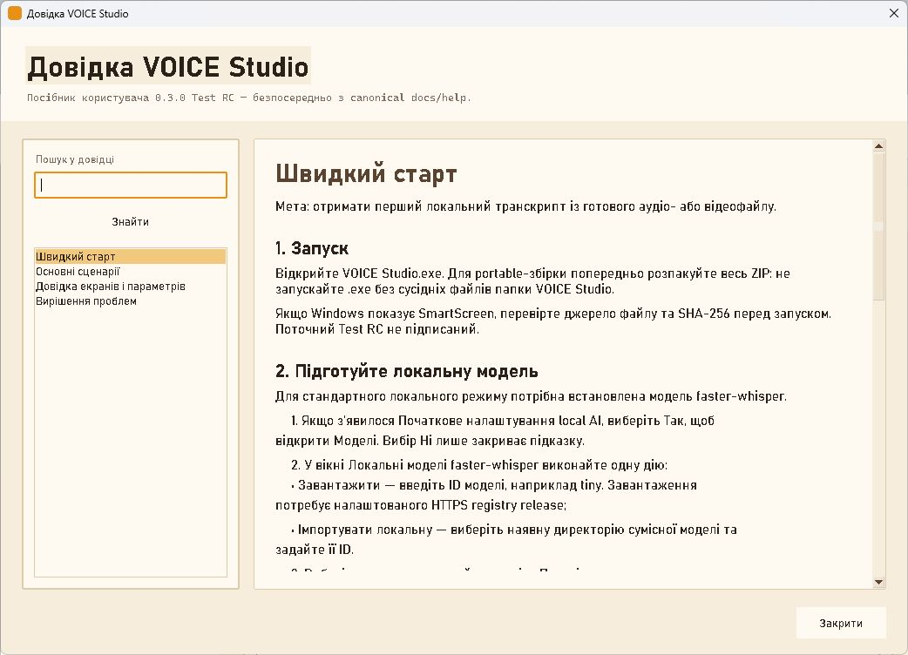

# Посібник користувача VOICE Studio

Версія: 0.3.0 Test RC. Мова посібника: українська.

VOICE Studio — локальна desktop-програма для перетворення мовлення з
мікрофона або медіафайлу на редагований текст. Стандартний движок
`faster-whisper` працює на цьому комп’ютері. Історія, моделі та результати
залишаються локальними, доки користувач окремо не вибере хмарну дію.

## Зміст

1. [Швидкий старт](quick-start.md) — перший локальний транскрипт.
2. [Основні сценарії](workflows.md) — запис, файли, редагування, експорт,
   історія, Ollama, моделі й резервні копії.
3. [Довідка екранів і параметрів](reference.md) — точні назви елементів,
   значення, формати та обмеження.
4. [Вирішення проблем](troubleshooting.md) — підтверджені симптоми й дії.

## Як відкрити довідку в програмі

Виберіть **Довідка** в лівому меню або натисніть **F1**. Вбудоване вікно читає
ці самі Markdown-файли, тому окремої прихованої копії manual у програмі немає.

## Основні терміни

- **Транскрипт** — збережений результат одного розпізнавання.
- **Оригінал** — незмінний текст, який повернув STT-движок (`raw_text`).
- **Виправлений текст** — робоча копія для ручного й AI-редагування
  (`corrected_text`).
- **Керована копія аудіо** — локальна копія, яку VOICE Studio створила у
  власному сховищі. Початковий файл користувача не є керованою копією.
- **Модель faster-whisper** — локальна модель розпізнавання мовлення.
- **Модель Ollama** — окрема локальна мовна модель для виправлення вже
  отриманого тексту; вона не виконує STT у цій версії.

## Межі Test RC

Збірка не має цифрового підпису, тому Windows SmartScreen може показати
попередження. Повна перевірка на чистому комп’ютері, матриця реальних
мікрофонів і глобальної гарячої клавіші не завершені. Якість розпізнавання
реального мовлення не заявляється без виміряного WER/CER.
