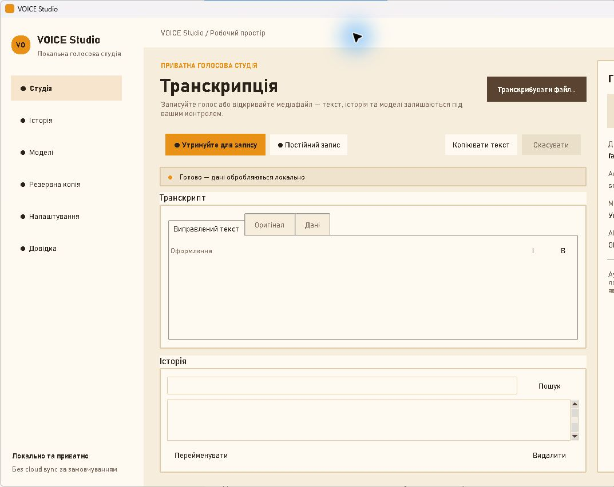

# Швидкий старт

Мета: отримати перший локальний транскрипт із готового аудіо- або відеофайлу.

## 1. Запуск

Відкрийте **VOICE Studio.exe**. Для portable-збірки попередньо розпакуйте весь
ZIP: не запускайте `.exe` без сусідніх файлів папки **VOICE Studio**.

Якщо Windows показує SmartScreen, перевірте джерело файлу та SHA-256 перед
запуском. Поточний Test RC не підписаний.

## 2. Підготуйте локальну модель

Для стандартного локального режиму потрібна встановлена модель
`faster-whisper`.

1. Якщо з’явилося **Початкове налаштування local AI**, виберіть **Так**, щоб
   відкрити **Моделі**. Вибір **Ні** лише закриває підказку.
2. У вікні **Локальні моделі faster-whisper** виконайте одну дію:
   - **Завантажити** — введіть ID моделі, наприклад `tiny`. Завантаження
     потребує налаштованого HTTPS registry release;
   - **Імпортувати локальну** — виберіть наявну директорію сумісної моделі та
     задайте її ID.
3. Виберіть модель у списку й натисніть **Перевірити**.
4. Відкрийте **Налаштування → Розпізнавання**. Для першого запуску використайте:
   - **Движок** — `faster-whisper`;
   - **Мова розпізнавання** — `auto` або відома мова `uk`, `cs`, `en`;
   - **Модель** — точний ID встановленої моделі;
   - **Пристрій** — `auto`;
   - **Тип обчислень** — `default`.
5. Натисніть **Зберегти**.

`tiny` є стартовим компактним профілем. `small` зазвичай потребує більше
пам’яті та дискового простору.

## 3. Вхідні дані

Підготуйте файл із голосом. Вікно вибору приймає: WAV, MP3, M4A, FLAC, OGG,
OPUS, AAC, MP4, MOV, MKV та WEBM. Файл повинен містити аудіодоріжку, бути не
порожнім, не перевищувати 2 GiB і дві години.

## 4. Виконання

1. На екрані **Студія** натисніть **Транскрибувати файл…**.
2. Виберіть медіафайл.
3. Стежте за рядком стану. Програма послідовно імпортує файл, завантажує
   локальну модель, розпізнає мовлення і зберігає результат.
4. Якщо потрібно припинити операцію, натисніть **Скасувати** й дочекайтеся
   стану **Задачу скасовано**.

Не закривайте програму примусово під час імпорту або збереження.

## 5. Результат

Після завершення:

- вкладка **Виправлений текст** містить робочий текст;
- вкладка **Оригінал** містить незмінний результат STT;
- вкладка **Дані** показує metadata транскрипту;
- запис з’являється у **Історії**.

Виправте текст за потреби й натисніть **Зберегти правки**. Для явного
копіювання в буфер обміну використайте **Копіювати текст**.

## 6. Що далі

[Запис із мікрофона](workflows.md#запис-із-мікрофона)

[Редагування і збереження](workflows.md#редагування-і-збереження)

[Експорт результату](workflows.md#експорт-результату)

[Локальне AI-редагування через Ollama](workflows.md#локальне-ai-редагування-через-ollama)
