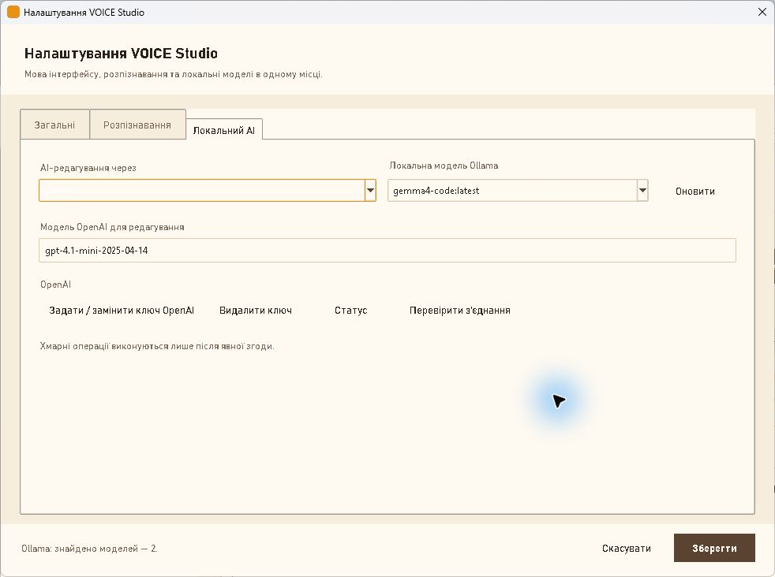

# Основні сценарії

## Транскрибування файлу

Використовуйте цей сценарій для готового аудіо або відео.

### Перед початком

- Встановіть і перевірте модель `faster-whisper`.
- У **Налаштування → Розпізнавання** перевірте модель, мову, пристрій і тип
  обчислень.

### Кроки

1. Відкрийте **Студія**.
2. Натисніть **Транскрибувати файл…**.
3. Виберіть підтримуваний медіафайл.
4. Дочекайтеся повідомлення про завершення або натисніть **Скасувати**.

### Результат

Текст відкривається в редакторі та зберігається в локальній історії. Вихідний
файл користувача не видаляється.

### Важливо

Якщо вибрано `openai-cloud`, програма окремо показує ім’я, розмір і факт
передавання аудіо та запитує **Передати аудіо OpenAI?**. Відмова завершує дію
без upload. `offline-only` блокує хмарний движок; автоматичного cloud fallback
немає.

## Запис із мікрофона

### Звичайний запис

1. Натисніть і утримуйте **● Утримуйте для запису**.
2. Говоріть у вибраний системою мікрофон.
3. Відпустіть кнопку. Запис зупиняється і передається на транскрибування.

### Постійний запис

1. Натисніть **● Постійний запис**.
2. Говоріть без утримування кнопки.
3. Натисніть **■ Зупинити запис**.

Глобальна гаряча клавіша запускає той самий сценарій. Її можна змінити через
**Налаштування → Загальні → Запам’ятати клавішу…**; **Esc** скасовує
захоплення нової комбінації.

VOICE Studio обмежує один запис двома годинами. Якщо виявлено втрату аудіоблоків
або іншу деградацію, з’являється **Пошкоджений запис**. Стандартна безпечна дія
— не продовжувати з таким записом.

Поточний Test RC має headless-перевірки lifecycle, але реальний мікрофон,
від’єднання пристрою та глобальна гаряча клавіша залежать від конкретної Windows
конфігурації й дозволів.

## Редагування і збереження

1. Виберіть транскрипт у **Історії** або дочекайтеся нового результату.
2. На вкладці **Виправлений текст** відредагуйте текст.
3. За потреби виділіть фрагмент і використайте **B** або **I**.
4. Натисніть **Зберегти правки**.

**Оригінал** доступний лише для читання. Ручні та AI-правки змінюють тільки
**Виправлений текст**. Під час переходу до іншого запису або закриття програми
незбережені правки викликають діалог **Незбережені правки**:

- **Так** — зберегти;
- **Ні** — відкинути;
- **Скасувати** — залишитися в поточному транскрипті.

Ручне редагування суцільного тексту не перерозподіляється автоматично між
сегментами субтитрів.

## Копіювання тексту

1. Відкрийте потрібний транскрипт.
2. Натисніть **Копіювати текст**.

Автоматичне копіювання вимкнене за замовчуванням. Його можна явно ввімкнути в
**Налаштування → Загальні**, але буфер обміну контролюється Windows: історія,
менеджери clipboard та синхронізація можуть зберігати скопійований текст поза
VOICE Studio.

## Експорт результату

1. Відкрийте транскрипт і збережіть правки.
2. Під редактором натисніть потрібний формат: **TXT**, **MD**, **JSON**,
   **SRT** або **VTT**.
3. Виберіть директорію та ім’я файлу.

TXT містить виправлений текст. MD додає основні metadata. JSON містить повний
структурований payload транскрипту. SRT/VTT створюються із сегментів та їхніх
часових меж.

## Робота з історією

### Пошук і відкриття

1. Введіть частину імені джерела у полі **Історія**.
2. Натисніть **Пошук** або Enter.
3. Виберіть запис у списку.

Інтерфейс показує до 250 результатів. Вибраний транскрипт відкривається в
редакторі.

### Перейменування

1. Виберіть запис.
2. Натисніть **Перейменувати**.
3. Введіть нове ім’я без шляху.

Змінюється назва транскрипту для історії й експорту. Аудіофайл не
перейменовується.

### Видалення

1. Виберіть запис і натисніть **Видалити**.
2. Підтвердьте видалення запису з історії.
3. Якщо існує керована копія аудіо, окремо виберіть: видалити її, залишити або
   скасувати всю дію.

Оригінальний файл користувача не видаляється. Керована копія також не
видаляється, якщо на неї посилається інший транскрипт.

## Локальне AI-редагування через Ollama

Ollama виправляє вже отриманий текст локально. Вона не замінює модель
`faster-whisper`.

### Перед початком

- Ollama має працювати на стандартній локальній адресі `127.0.0.1:11434`.
- Принаймні одна Ollama-модель має бути встановлена поза VOICE Studio.

### Налаштування

1. Відкрийте **Налаштування → Локальний AI**.
2. У **AI-редагування через** виберіть `ollama`.
3. Натисніть **Оновити** біля **Локальна модель Ollama**.
4. Виберіть модель зі знайденого списку й натисніть **Зберегти**.

VOICE Studio не встановлює, не оновлює й не видаляє Ollama-моделі.

### Застосування

1. Відкрийте транскрипт.
2. Збережіть незавершені ручні правки.
3. Натисніть **AI-редагування…**.
4. Перегляньте Before/After proposal.
5. Підтвердьте **Застосувати це AI-редагування?**.

Після застосування можна використати **Скасувати AI-редагування**. Оригінальний
STT-текст залишається незмінним. Якщо транскрипт змінився після створення
proposal, застаріла пропозиція не застосовується.

## Керування моделями faster-whisper

Відкрийте **Моделі** в лівому меню.

- **Імпортувати локальну** — копіює перевірену сумісну директорію у керований
  каталог і просить безпечний ID.
- **Завантажити** — отримує модель із налаштованого HTTPS release registry;
  `offline-only` блокує цю дію.
- **Перевірити** — звіряє inventory та SHA-256 встановленої моделі.
- **Видалити** — після підтвердження видаляє лише керовану модель. Початкова
  директорія, з якої виконано імпорт, не видаляється.

Модель повинна містити щонайменше `model.bin` і `config.json`. SHA-256 перевіряє
цілісність, але не є підписом видавця.

## Резервна копія і відновлення

1. Відкрийте **Резервна копія**.
2. Щоб створити `.voice-backup`, за потреби ввімкніть **Включити керовані копії
   аудіо** та натисніть **Створити…**.
3. Для готового архіву спочатку використайте **Перевірити…**.
4. Для відновлення натисніть **Відновити…**, виберіть перевірений архів і
   підтвердьте дію.

Backup містить історію, налаштування, словник і, за явним вибором, керовані
копії аудіо. Зовнішні оригінали та моделі не включаються. Перед restore поточне
сховище переноситься в recovery directory, а не видаляється. Не закривайте
програму, доки операція резервної копії не завершиться.

Якщо відновлення все ж перервано (втрата живлення, примусове завершення
процесу), VOICE Studio завершує або скасовує його самостійно під час
наступного запуску та повідомляє про це в рядку стану. Recovery directory
залишається на диску в обох випадках.
